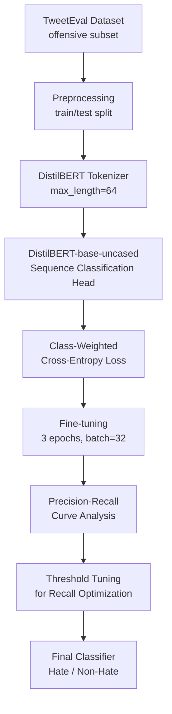

# 🛡️ Hate Speech Detection using DistilBERT

<p align="center">
  
  
  
  
  
  
</p>

<p align="center">
  A fine-tuned <b>DistilBERT</b> transformer model that classifies tweets as <b>Hate/Offensive</b> or <b>Non-Hate</b>, 
  with class-weighted loss and precision-recall threshold tuning to handle real-world class imbalance.
</p>

---

## 📌 Overview

Social media platforms generate massive volumes of user text, and manually moderating hate speech doesn't scale. 
This project fine-tunes a transformer-based language model on the **TweetEval (offensive)** dataset to automatically 
flag offensive/hateful tweets, with a focus on **maximizing recall on the minority (hate) class** — since missing 
real hate speech is a costlier error than over-flagging borderline content.

---

## 🔄 Pipeline



---

## 🧠 Model Architecture

| Component | Detail |
|---|---|
| Base Model | `distilbert-base-uncased` |
| Task Head | Sequence Classification (`num_labels=2`) |
| Tokenization | Max length 64, truncation + padding |
| Loss Function | Weighted Cross-Entropy (handles class imbalance) |
| Optimizer | AdamW (via HuggingFace `Trainer`) |
| Epochs | 3 |
| Batch Size | 32 (train & eval) |

---

## 📊 Dataset

**Source:** [`cardiffnlp/tweet_eval`](https://huggingface.co/datasets/cardiffnlp/tweet_eval) — `offensive` subset

| Split | Samples |
|---|---|
| Train | 11,916 |
| Validation | 1,324 |
| Test | 860 |

Labels: `0` = Non-Offensive, `1` = Offensive/Hate

---

## 📈 Results

### Classification Report (Threshold = 0.30, recall-optimized)

| Class | Precision | Recall | F1-Score | Support |
|---|---|---|---|---|
| Non-Hate (0) | 0.64 | 0.71 | 0.67 | 620 |
| Hate (1) | 0.64 | 0.71 | 0.67 | 240 |
| **Accuracy** | | | **~0.72** | 860 |

> 📌 **Note:** Threshold was deliberately tuned *below* the default 0.5 to prioritize catching more hate speech (recall), 
> trading off some precision — the right choice for a moderation-support tool over a strict accuracy-only benchmark.

### Precision-Recall Curve

The model's PR curve was analyzed across thresholds (0.2–0.7) to find the optimal recall/precision balance for the 
hate class, rather than relying on the default 0.5 cutoff:

| Threshold | Precision | Recall | F1 |
|---|---|---|---|
| 0.20 | 0.613 | 0.733 | 0.668 |
| 0.30 ✅ | 0.638 | 0.713 | 0.673 |
| 0.40 | 0.686 | 0.692 | 0.689 |
| 0.50 (default) | 0.721 | 0.679 | 0.700 |
| 0.60 | 0.754 | 0.662 | 0.705 |
| 0.70 | 0.782 | 0.642 | 0.705 |

### Confusion Matrix

Visualizes true vs. predicted labels on the held-out test set — see notebook for the rendered heatmap.

---

## 🔍 Example Predictions

```python
predict_text("I hate you")           # → Hate / Offensive
predict_text("you are a f***ing idiot")  # → Hate / Offensive
predict_text("go kill yourself")     # → Hate / Offensive
predict_text("have a nice day")      # → Non-Hate
```

---

## ⚙️ Tech Stack

- **Language:** Python 3.12
- **Modeling:** PyTorch, HuggingFace Transformers
- **Data:** HuggingFace Datasets
- **Evaluation:** scikit-learn (classification report, PR curve, confusion matrix)
- **Visualization:** Matplotlib, Seaborn
- **Environment:** Google Colab (GPU — T4)

---

## 🚀 Key Engineering Decisions

- ✅ Used **class-weighted cross-entropy loss** to counter the ~2.5:1 class imbalance in the dataset, instead of naively 
  training on raw label distribution.
- ✅ Performed **threshold tuning via precision-recall curve** rather than relying on the default 0.5 cutoff — critical 
  for imbalanced classification tasks where the "important" class is the minority one.
- ✅ Explicitly evaluated the **recall/precision tradeoff** and documented the reasoning for the chosen operating point, 
  rather than optimizing blindly for accuracy or F1 alone.

---

## 📁 Repository Structure

```
Hate-Speech-Detection-BERT/
│
├── hate_speech_detection.ipynb   # Full notebook: data, training, evaluation, inference
└── README.md
```

---

## 🔮 Future Improvements

- Swap base model for a Twitter-domain pretrained model (e.g., `cardiffnlp/twitter-roberta-base-hate`) for better 
  in-domain performance
- Expand training data beyond TweetEval to reduce label noise and improve minority-class recall further
- Deploy as a lightweight API (FastAPI) for real-time inference
- Add multi-label classification to distinguish *hate speech* from general *offensive language*

---

## 👤 Author

**Nikita Debnath**  
B.Tech CSE (Data Science) — Jain University, Bengaluru  
[GitHub: nikitadn10](https://github.com/nikitadn10)

---

<p align="center"><i>Built as part of an NLP/deep learning portfolio project.</i></p>
